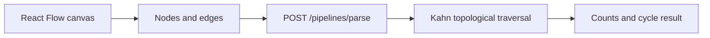

# VectorShift Pipeline Builder Assessment

A React Flow editor backed by a small FastAPI graph-analysis endpoint.
Build a pipeline, add node connections, then submit it to count nodes and edges and check for
cycles.
This is an assessment implementation, not a pipeline execution service.

## What is built

- Reusable node components backed by centralized node definitions.
- Example flows, canvas controls, minimap and drag/drop node creation.
- Text-node resizing and variable-based input handles.
- Submission feedback from the backend's directed-acyclic-graph check.



## Start the two services

Use Python 3.10+ and a Node version compatible with the frontend lockfile.

```bash
git clone https://github.com/DanushArun/vectorshift-assessment.git
cd vectorshift-assessment
python3 -m venv backend/.venv
backend/.venv/bin/pip install -r backend/requirements.txt
backend/.venv/bin/uvicorn main:app --app-dir backend --reload --port 8000
```

In another terminal, from the repository root:

```bash
cd frontend
npm ci
npm start
```

Open `http://localhost:3000`. The API allows the localhost frontend origins.

## API contract

`POST /pipelines/parse` accepts `nodes` with string `id` values and `edges` with
`source` and `target`. It returns `num_nodes`, `num_edges` and Boolean `is_dag`.
The counts describe the supplied arrays. Graph traversal also includes endpoints referenced
by edges, even when those IDs are absent from the nodes array.

## Verification and structure

```bash
backend/.venv/bin/python -m unittest discover backend
cd frontend
npm test -- --watchAll=false
npm run build
```

- [backend/main.py](backend/main.py): payload models, graph traversal and routes.
- [backend/test_main.py](backend/test_main.py): graph behavior tests.
- [frontend/src/nodes](frontend/src/nodes): node abstraction and text-node logic.
- [frontend/src/submit.js](frontend/src/submit.js): submission integration.

Source, tests and package scripts were inspected for this README; the full suite and frontend
build were not rerun. A DAG result checks graph structure, not executable node semantics.
