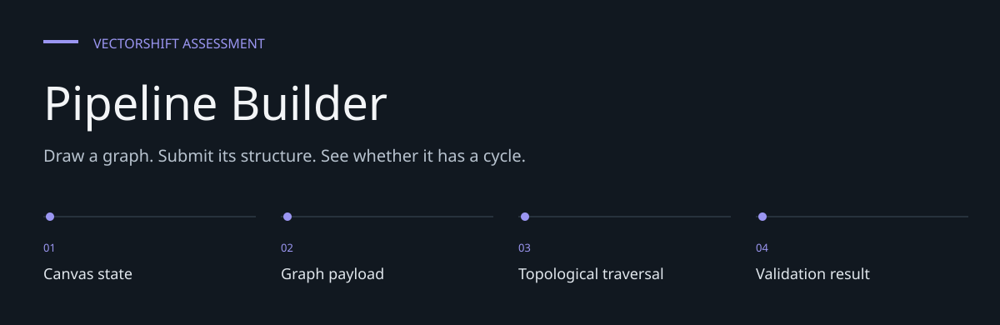
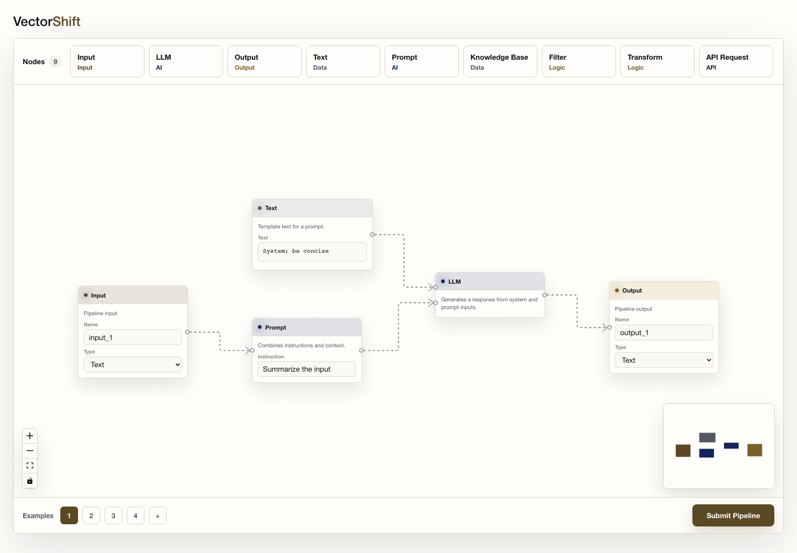
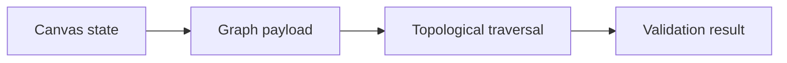
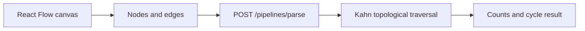

# Pipeline Builder

**Draw a graph. Submit its structure. See whether it has a cycle.**

A React Flow editor backed by a small FastAPI graph-analysis endpoint.
Build a pipeline, add node connections, then submit it to count nodes and edges and check for
cycles.
This is an assessment implementation, not a pipeline execution service.


[Architecture](docs/ARCHITECTURE.md) · [Evaluation guide](docs/EVALUATION.md)

**Contents:** [The challenge](#the-challenge) · [Walkthrough](#walk-through-the-project) ·
[Implementation](#implementation-state) · [Design choices](#engineering-choices) ·
[Next evidence](#next-evidence-to-collect)

---

## The challenge

A pipeline editor needs reusable nodes, predictable connection behavior and a backend that can
reason about the submitted graph. This assessment separates interactive editing from structural
validation, making counts and cycle detection visible to the user.

## Browser preview



*Captured from the production build on 7 October 2026; no live backend submission.*

## System at a glance



## Walk through the project

### 1. Build a graph

Drag nodes into the React Flow canvas or load an example. Inspect node identifiers and the
connections represented in store state.

### 2. Use text variables

Enter variable syntax in a Text node and inspect dynamically created handles. Node sizing and
handle derivation are implemented separately from backend graph traversal.

### 3. Submit the graph

The frontend sends node IDs and source/target edges to /pipelines/parse. The backend models
validate the request shape.

### 4. Read the result

The response reports array counts and DAG status. It does not execute an LLM, input transformation
or other node operation.

## What is built

- Reusable node components backed by centralized node definitions.
- Example flows, canvas controls, minimap and drag/drop node creation.
- Text-node resizing and variable-based input handles.
- Submission feedback from the backend's directed-acyclic-graph check.



## Start the two services

Use Python 3.10+ and a Node version compatible with the frontend lockfile.

```bash
git clone https://github.com/DanushArun/vectorshift-assessment.git
cd vectorshift-assessment
python3 -m venv backend/.venv
backend/.venv/bin/pip install -r backend/requirements.txt
backend/.venv/bin/uvicorn main:app --app-dir backend --reload --port 8000
```

In another terminal, from the repository root:

```bash
cd frontend
npm ci
npm start
```

Open `http://localhost:3000`. The API allows the localhost frontend origins.

## API contract

`POST /pipelines/parse` accepts `nodes` with string `id` values and `edges` with
`source` and `target`. It returns `num_nodes`, `num_edges` and Boolean `is_dag`.
The counts describe the supplied arrays. Graph traversal also includes endpoints referenced
by edges, even when those IDs are absent from the nodes array.

## Verification and structure

```bash
backend/.venv/bin/python -m unittest discover backend
cd frontend
npm test -- --watchAll=false
npm run build
```

- [backend/main.py](backend/main.py): payload models, graph traversal and routes.
- [backend/test_main.py](backend/test_main.py): graph behavior tests.
- [frontend/src/nodes](frontend/src/nodes): node abstraction and text-node logic.
- [frontend/src/submit.js](frontend/src/submit.js): submission integration.

Source, tests and package scripts were inspected for this README; fresh suite/build results are
recorded below. A DAG result checks graph structure, not executable node semantics.

## Engineering choices

**Registry-backed nodes.** Shared rendering behavior is separated from individual node definitions.

**Kahn traversal.** Indegree-based traversal detects whether all graph vertices can be visited
without a cycle.

**Array counts vs graph vertices.** Edge endpoints can expand traversal vertices while counts
still describe submitted arrays.

## Implementation state

| State | Current evidence |
| --- | --- |
| Present | Reusable node registry and editor controls |
| Present | Text variable handles and example flows |
| Present | Count/DAG endpoint and behavioral test sources |
| Out of scope | Executable pipeline semantics and production auth |

The [architecture guide](docs/ARCHITECTURE.md) maps these statements to source entry points.
The [evaluation guide](docs/EVALUATION.md) separates inspection, executable checks and
domain validation, with the next evidence needed for each project.

## Next evidence to collect

- Record backend and frontend suite results with absolute counts.
- Exercise invalid payload and dangling-endpoint behavior through the UI.
- Capture keyboard and narrow-screen editing behavior.

## Recorded checks — 7 October 2026

| Check | Observation |
| --- | --- |
| Backend behavior | 3 passed, 0 failed |
| Frontend behavior | 38 passed; 11 suites passed |
| Production build | Passed |
| Browser preview | Static editor preview captured; no live submission |

Commands used:

```text
python -m unittest discover backend
npm test -- --watchAll=false --runInBand
npm run build
Chromium at 1440 × 1000
```

These results cover the listed software paths. They do not establish live deployment,
external-service compatibility, accessibility conformance or domain efficacy.
