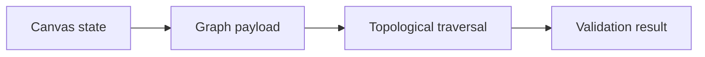

# Pipeline Builder — Architecture and implementation

This guide follows the tracked implementation. Proposed work is identified separately.

## The problem and the system boundary

A pipeline editor needs reusable nodes, predictable connection behavior and a backend that can
reason about the submitted graph. This assessment separates interactive editing from structural
validation, making counts and cycle detection visible to the user.

## Processing path

## End-to-end behavior

### 1. Build a graph

Drag nodes into the React Flow canvas or load an example. Inspect node identifiers and the
connections represented in store state.

### 2. Use text variables

Enter variable syntax in a Text node and inspect dynamically created handles. Node sizing and
handle derivation are implemented separately from backend graph traversal.

### 3. Submit the graph

The frontend sends node IDs and source/target edges to /pipelines/parse. The backend models
validate the request shape.

### 4. Read the result

The response reports array counts and DAG status. It does not execute an LLM, input transformation
or other node operation.

## Design choices and consequences

### Registry-backed nodes

Shared rendering behavior is separated from individual node definitions.

### Kahn traversal

Indegree-based traversal detects whether all graph vertices can be visited without a cycle.

### Array counts vs graph vertices

Edge endpoints can expand traversal vertices while counts still describe submitted arrays.

## Source entry points

### [frontend/src/nodes/BaseNode.js](../frontend/src/nodes/BaseNode.js)

This file is part of the reviewed path described above. Follow its imports and calls
for the exact interface rather than inferring behavior from the filename.

### [frontend/src/nodes/textNodeLogic.js](../frontend/src/nodes/textNodeLogic.js)

This file is part of the reviewed path described above. Follow its imports and calls
for the exact interface rather than inferring behavior from the filename.

### [frontend/src/store.js](../frontend/src/store.js)

This file is part of the reviewed path described above. Follow its imports and calls
for the exact interface rather than inferring behavior from the filename.

### [frontend/src/submit.js](../frontend/src/submit.js)

This file is part of the reviewed path described above. Follow its imports and calls
for the exact interface rather than inferring behavior from the filename.

### [backend/main.py](../backend/main.py)

- `PipelineNode` — Implementation entry; inspect source for its exact behavior.
- `PipelineEdge` — Implementation entry; inspect source for its exact behavior.
- `PipelinePayload` — Implementation entry; inspect source for its exact behavior.
- `build_graph` — Implementation entry; inspect source for its exact behavior.
- `is_directed_acyclic_graph` — Implementation entry; inspect source for its exact behavior.
- `parse_pipeline_payload` — Implementation entry; inspect source for its exact behavior.

## Implementation state

| State | Evidence boundary |
| --- | --- |
| Present | Reusable node registry and editor controls |
| Present | Text variable handles and example flows |
| Present | Count/DAG endpoint and behavioral test sources |
| Out of scope | Executable pipeline semantics and production auth |

“Present” means tracked source or assets exist. It does not mean a production or domain
validation has passed. See [Evaluation](EVALUATION.md) for reproducible checks and limits.
